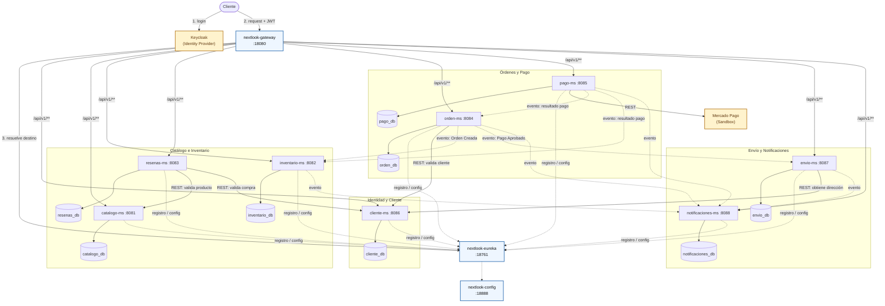
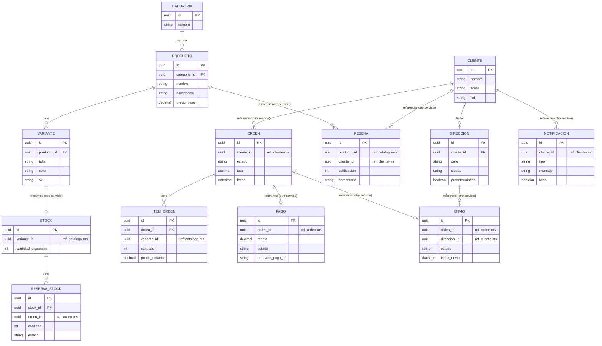
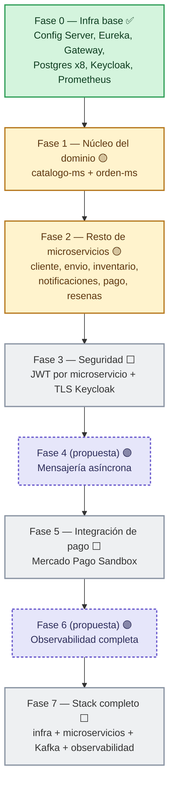

# NextLook

E-commerce de moda basado en microservicios. Ver [docs/index.md](docs/index.md) para la arquitectura completa (diagramas C4, flujo de dominio, seguridad, comunicación entre servicios).

## Estructura del repositorio

```
NextLook/
├── docker/     # Orquestación local de toda la infraestructura (docker-compose)
├── docs/       # Documentación de arquitectura (servida con MkDocs)
├── infra/      # Piezas de infraestructura compartida: Config Server, Eureka, Gateway
├── obs/        # Observabilidad (Grafana, Prometheus, Promtail) y overrides de despliegue
└── services/   # Los 8 microservicios de negocio, cada uno con su propio código y config
```

Cada carpeta principal tiene su propio `README.md` con el detalle de qué contiene y cómo se usa.

## Arranque rápido (entorno de desarrollo)

```
docker compose \
  -f docker/docker-compose.infra.yml \
  -f services/compose-dev.yml \
  -f obs/compose-dev.yml \
  up -d --build
```

Levanta el Config Server, Eureka, el Gateway, una base Postgres por microservicio, Keycloak, los 8 microservicios (como esqueleto bootable, ver [Estado de avance](docs/avance.md)) y Prometheus.

| Servicio | URL |
|---|---|
| Gateway | http://localhost:18080 |
| Eureka | http://localhost:18761 |
| Config Server | http://localhost:18888 |
| Prometheus | http://localhost:19090/targets |
| catalogo-ms / inventario-ms / resenas-ms / orden-ms / pago-ms / cliente-ms / envio-ms / notificaciones-ms | 8081-8088 |

También se puede levantar solo la infra (sin microservicios) con `docker compose -f docker/docker-compose.infra.yml up -d`, y correr un microservicio suelto localmente con `mvn spring-boot:run` apuntando a esa infra ya dockerizada.

> **Desde el navegador, siempre `localhost`, nunca el nombre del contenedor.** `http://orden-ms:8084/...` solo resuelve *dentro* de la red de Docker (por eso Eureka y Prometheus lo usan entre ellos); desde tu PC es `http://localhost:8084/...`.

## Documentación

```
docker run --rm -it -p 8000:8000 -v "${PWD}:/docs" squidfunk/mkdocs-material
```

Sirve la documentación completa (arquitectura, seguridad, cada microservicio, estado de avance) en http://localhost:8000.

## Identidades y relaciones

Vista técnica actual (complementa el [C4 de dominio](docs/arquitectura.md), que todavía no dibuja Gateway/Eureka/Config Server por estar "pendientes de confirmar" en el brief — acá ya son reales):



Flechas continuas = síncrono (REST) o ruteo; flechas punteadas = eventos asíncronos (todavía sin tecnología de mensajería elegida, ver [Comunicación](docs/comunicacion.md)) y registro/descubrimiento en Eureka.

## Modelo entidad-relación

> ⚠️ **Propuesta, no un modelo confirmado.** Ningún microservicio tiene entidades implementadas todavía (la sección "Entidades" de cada [ficha en docs/microservicios](docs/microservicios/orden-ms.md) sigue en TODO). Este diagrama es un punto de partida razonable a partir de lo que el [brief](docs/brief.md) sí describe (qué administra cada servicio), para que el equipo lo discuta y ajuste, no un esquema ya acordado.

Cada microservicio es dueño de su propia base — no hay FK real entre servicios (líneas punteadas abajo = referencia lógica por id, resuelta por REST/eventos, no por JOIN):



## Roadmap



Fases 1, 2, 3, 5, 7 confirmadas (vienen de comentarios ya presentes en `services/*/config/*.yml`); 4 y 6 son propuesta a confirmar con el equipo. Detalle completo, con lo que falta en cada una: [docs/avance.md](docs/avance.md).

## Equipo

Anghelo, Yeins, Daniel, Johan — Docente: Abel Angel Sullon Macalupu.
