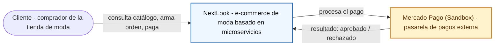

# Arquitectura

Diagramas C4 de NextLook: contexto del sistema (nivel 1) y contenedores (nivel 2). Ambos se explican debajo con el mismo detalle que aparece en [Inicio](index.md).

## Nivel 1: Contexto del sistema

Este nivel responde una sola pregunta: **quién usa el sistema y con qué otro sistema conversa**. NextLook aparece como una caja negra — no hay microservicios, ni eventos, ni Keycloak todavía. El cliente interactúa con NextLook; NextLook, a su vez, delega el cobro en Mercado Pago (Sandbox), el único sistema externo real confirmado en el brief.

## Nivel 2: Contenedores

```mermaid
%%{init: {"flowchart": {"nodeSpacing": 20, "rankSpacing": 34, "curve": "basis"}} }%%
flowchart TB
    Cliente(["Cliente"])

    subgraph IdentidadCliente["Identidad y Cliente"]
        Keycloak["Keycloak - Identity Provider (emite JWT)"]
        ClienteMS["cliente-ms (no transaccional)"]
        ClienteDB[("cliente_db")]
        ClienteMS --> ClienteDB
    end

    subgraph CatalogoInventario["Catálogo e Inventario"]
        CatalogoMS["catalogo-ms (no transaccional)"]
        CatalogoDB[("catalogo_db")]
        InventarioMS["inventario-ms (transaccional)"]
        InventarioDB[("inventario_db")]
        ResenasMS["resenas-ms (no transaccional)"]
        ResenasDB[("resenas_db")]
        CatalogoMS --> CatalogoDB
        InventarioMS --> InventarioDB
        ResenasMS --> ResenasDB
    end

    subgraph OrdenPago["Órdenes y Pago"]
        OrdenMS["orden-ms (transaccional)"]
        OrdenDB[("orden_db")]
        PagoMS["pago-ms (transaccional)"]
        PagoDB[("pago_db")]
        OrdenMS --> OrdenDB
        PagoMS --> PagoDB
    end

    subgraph EnvioNotif["Envío y Notificaciones"]
        EnvioMS["envio-ms (transaccional)"]
        EnvioDB[("envio_db")]
        NotifMS["notificaciones-ms (no transaccional)"]
        NotifDB[("notificaciones_db")]
        EnvioMS --> EnvioDB
        NotifMS --> NotifDB
    end

    MercadoPago["Mercado Pago (Sandbox) - sistema externo"]

    %% Punto de entrada del cliente (Gateway u otro componente de acceso: PENDIENTE de confirmar)
    Cliente -->|"consulta catálogo"| CatalogoMS
    Cliente -->|"gestiona perfil / direcciones"| ClienteMS
    Cliente -->|"crea orden"| OrdenMS
    Cliente -->|"escribe reseña"| ResenasMS

    %% Comunicación síncrona (REST/Feign)
    OrdenMS -->|"REST: valida cliente"| ClienteMS
    EnvioMS -->|"REST: obtiene dirección"| ClienteMS
    ResenasMS -->|"REST: valida producto"| CatalogoMS
    ResenasMS -->|"REST: valida compra"| ClienteMS
    PagoMS -->|"REST: procesa pago"| MercadoPago

    %% Comunicación asíncrona (eventos)
    OrdenMS -.->|"evento: Orden Creada"| InventarioMS
    PagoMS -.->|"evento: resultado del pago"| OrdenMS
    PagoMS -.->|"evento: resultado del pago"| InventarioMS
    OrdenMS -.->|"evento: Pago Aprobado"| EnvioMS
    OrdenMS -.->|"evento"| NotifMS
    PagoMS -.->|"evento"| NotifMS
    InventarioMS -.->|"evento"| NotifMS
    EnvioMS -.->|"evento"| NotifMS

    %% Seguridad: cada microservicio valida el JWT emitido por Keycloak de forma independiente
    Keycloak -.->|"valida JWT"| ClienteMS
    Keycloak -.->|"valida JWT"| CatalogoMS
    Keycloak -.->|"valida JWT"| InventarioMS
    Keycloak -.->|"valida JWT"| ResenasMS
    Keycloak -.->|"valida JWT"| OrdenMS
    Keycloak -.->|"valida JWT"| PagoMS
    Keycloak -.->|"valida JWT"| EnvioMS
    Keycloak -.->|"valida JWT"| NotifMS

    classDef external fill:#fff3cd,stroke:#b7791f,stroke-width:2px,color:#5f370e;
    class MercadoPago external;
```

Convención del diagrama: **flechas continuas** = comunicación síncrona (REST/Feign) o acceso directo del cliente; **flechas punteadas** = comunicación asíncrona por eventos, y también la dependencia de seguridad de cada microservicio hacia Keycloak (validar el JWT no es un evento de negocio, pero tampoco es una llamada síncrona de dominio).

Los 8 microservicios están agrupados en 4 dominios:

- **Identidad y Cliente**: Keycloak (autenticación) y `cliente-ms` (perfiles, direcciones).
- **Catálogo e Inventario**: `catalogo-ms` (prendas, categorías, variantes), `inventario-ms` (stock, reservas) y `resenas-ms` (reseñas y calificaciones, que depende de catálogo y cliente para validar).
- **Órdenes y Pago**: `orden-ms` (coordina el flujo de compra) y `pago-ms` (integra Mercado Pago).
- **Envío y Notificaciones**: `envio-ms` (seguimiento de entrega) y `notificaciones-ms` (avisos por evento).

Cada microservicio tiene su propia base de datos — no se comparten tablas entre servicios, consistente con el estilo de arquitectura de microservicios.

!!! warning "Datos pendientes de confirmar"
    No se dibujan puertos, Config Server, Eureka/discovery, API Gateway, ni tecnología de mensajería (Kafka/RabbitMQ/otro) porque el brief aprobado no los especifica todavía. Tampoco se asigna motor de base de datos a los cilindros — son data stores lógicos, no un producto concreto. Cuando el equipo defina esos componentes de infraestructura, hay que actualizar este diagrama.
