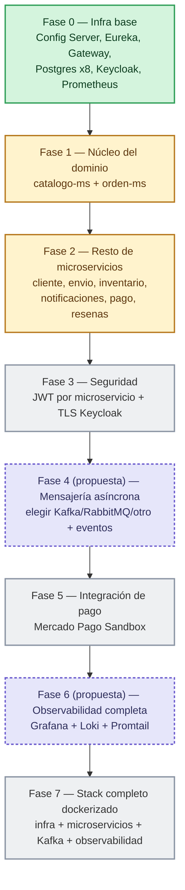

# Estado de avance

Foto del proyecto al **2026-09-11**: qué está implementado y corriendo, qué es solo esqueleto, y qué falta. Se actualiza a medida que avanza cada fase del [Roadmap](#roadmap).

## Resumen

| Componente | Estado | Detalle |
|---|---|---|
| Config Server (`nextlook-config`) | ✅ Implementado | Sirve configuración a todos los demás desde [infra/config-repo](../infra/config-repo) y `services/*/config`. |
| Eureka (`nextlook-eureka`) | ✅ Implementado | Service Registry, sin lógica propia. |
| Gateway (`nextlook-gateway`) | ✅ Implementado | Rutas `/api/v1/**` → microservicios, ya con las 9 rutas del [brief](brief.md) definidas por config. |
| 8 microservicios | 🟡 Esqueleto bootable | Arrancan, se registran en Eureka, exponen `/actuator/health` y `/swagger-ui.html`. **Sin entidades, repositorios ni controladores de negocio todavía** — ver TODOs en [Microservicios](microservicios/orden-ms.md). |
| Prometheus | ✅ Implementado | Descubre y scrapea los 8 microservicios vía Eureka (`eureka_sd_configs`), más Config/Eureka/Gateway por dirección fija. |
| Grafana / Loki / Promtail | ⬜ Pendiente | Carpetas y datasource ya preparados en [obs/](../obs), falta levantarlos. |
| Seguridad (Keycloak / JWT) | ⬜ Pendiente | Keycloak corre en Docker (`docker/docker-compose.infra.yml`), pero ningún microservicio valida JWT todavía — no hay endpoints de negocio que proteger aún (ver [Seguridad](seguridad.md)). |
| Mensajería asíncrona | ⬜ Sin definir | El brief no especifica Kafka/RabbitMQ/otro (ver [Comunicación](comunicacion.md)); los 8 microservicios ni siquiera tienen la lógica que dispararía esos eventos todavía. |
| Lógica de negocio | ⬜ Pendiente | Entidades, repositorios, controladores y migraciones Flyway de cada microservicio. |

## Cómo levantar todo (dev)

```bash
docker compose \
  -f docker/docker-compose.infra.yml \
  -f services/compose-dev.yml \
  -f obs/compose-dev.yml \
  up -d --build
```

Levanta: Config Server, Eureka, Gateway, Keycloak, una base Postgres por microservicio, los 8 microservicios y Prometheus (definidos en `docker/docker-compose.infra.yml`, `services/compose-dev.yml` y `obs/compose-dev.yml`).

| Servicio | URL |
|---|---|
| Gateway | http://localhost:18080 |
| Eureka | http://localhost:18761 |
| Config Server | http://localhost:18888 |
| Prometheus | http://localhost:19090/targets |
| catalogo-ms | http://localhost:8081 |
| inventario-ms | http://localhost:8082 |
| resenas-ms | http://localhost:8083 |
| orden-ms | http://localhost:8084 |
| pago-ms | http://localhost:8085 |
| cliente-ms | http://localhost:8086 |
| envio-ms | http://localhost:8087 |
| notificaciones-ms | http://localhost:8088 |

Cada microservicio expone `/actuator/health` y `/swagger-ui.html`.

## Roadmap

Fases 1, 2, 3, 5 y 7 vienen de los comentarios "Placeholder... ver Fase N" ya presentes en `services/*/config/*.yml` y en `docker/docker-compose.infra.yml`. Las fases 4 y 6 no están definidas en ningún documento del equipo todavía — se muestran acá como **propuesta** para llenar el hueco lógico entre "negocio" (fase 2), "pagos" (fase 5) y "stack completo" (fase 7); hay que confirmarlas con el equipo, no darlas por definitivas.



- 🟢 **Fase 0 — hecha**: es lo que se levantó hoy (este documento).
- 🟡 **Fases 1-2 — en progreso**: el esqueleto de los 8 microservicios ya existe; falta la lógica de negocio real de cada uno.
- ⬜ **Fase 3, 5, 7 — pendientes**, confirmadas por el equipo pero sin empezar.
- 🟣 **Fases 4, 6 — propuestas**, a confirmar.

## Qué falta para que cada fase esté "hecha"

| Fase | Para darla por completa hace falta |
|---|---|
| 1 | Entidades + repositorios + controladores REST de `catalogo-ms` y `orden-ms`, con sus endpoints documentados en [microservicios/](microservicios/orden-ms.md). |
| 2 | Lo mismo para `cliente-ms`, `envio-ms`, `inventario-ms`, `notificaciones-ms`, `pago-ms`, `resenas-ms`. |
| 3 | Cada microservicio validando JWT de Keycloak (Spring Security OAuth2 Resource Server) + TLS real en Keycloak. |
| 4 | Elegir la tecnología de mensajería y publicar/consumir los eventos de [Comunicación](comunicacion.md). |
| 5 | `pago-ms` llamando a la API real de Mercado Pago Sandbox (ver [Integración de pago](integracion-pago.md)). |
| 6 | `obs/compose-dev.yml` con Grafana + Loki + Promtail levantados y con dashboards reales. |
| 7 | Un solo `docker-compose` de producción local con todo junto (hoy son 3 archivos combinados a mano). |
