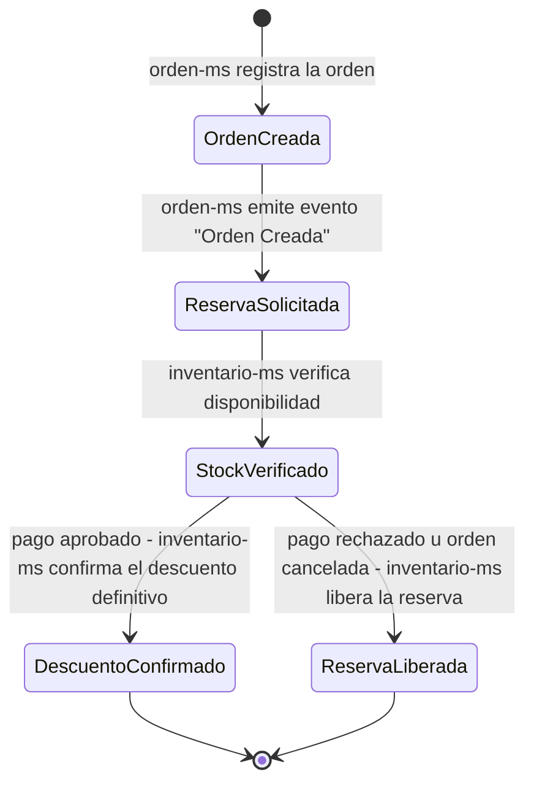

# Consistencia de datos

`inventario-ms` y `orden-ms` mantienen consistencia entre la orden y el stock mediante la entidad `reserva_stock`, no mediante una transacción distribuida.

## Entidad `reserva_stock`

| Campo | Descripción |
|---|---|
| `id` | Identificador de la reserva. |
| `orden_id` | Orden asociada. |
| `producto_id` | Producto/variante reservado. |
| `cantidad` | Cantidad reservada. |
| `estado` | Estado actual de la reserva (ver diagrama). |

## Diagrama de estados

## Reglas

- **Orden creada → Reserva solicitada → Stock verificado**: flujo normal al iniciar una compra.
- **Pago aprobado**: `inventario-ms` confirma el descuento definitivo de stock.
- **Pago rechazado u orden cancelada**: `inventario-ms` libera la reserva, el stock vuelve a estar disponible.

La transición desde `StockVerificado` depende exclusivamente del evento de resultado del pago emitido por `pago-ms` (ver [Integración de pago](integracion-pago.md)) — no hay una transacción única que abarque `orden-ms`, `inventario-ms` y `pago-ms` a la vez.
