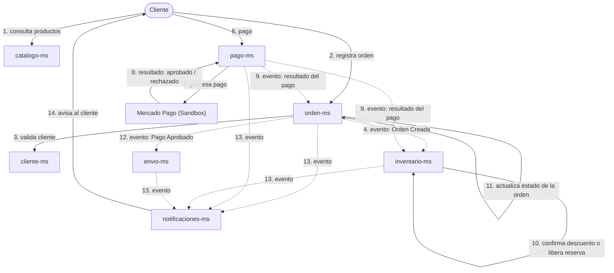

# Flujo end-to-end

Recorrido completo de una compra en NextLook: Catálogo → Selección → Orden → Reserva de stock → Pago → Confirmación.

## Qué es síncrono y qué es asíncrono

- **Síncronas (resuelven de inmediato):** cliente consulta `catalogo-ms`; cliente registra orden en `orden-ms`; `orden-ms` valida cliente contra `cliente-ms`; cliente paga en `pago-ms`; `pago-ms` llama a Mercado Pago.
- **Asíncronas (viajan como eventos):** `orden-ms` → `inventario-ms` (Orden Creada); `pago-ms` → `orden-ms` / `inventario-ms` (resultado del pago); `orden-ms` → `envio-ms` (Pago Aprobado); `orden-ms`, `pago-ms`, `inventario-ms`, `envio-ms` → `notificaciones-ms`.

## Pasos del flujo

1. El cliente consulta productos en `catalogo-ms`.
2. Registra una orden en `orden-ms`.
3. `orden-ms` valida al cliente contra `cliente-ms` (síncrono).
4. `orden-ms` emite el evento "Orden Creada"; `inventario-ms` lo consume y solicita/verifica la reserva de stock.
5. El cliente paga a través de `pago-ms`, que llama a Mercado Pago (Sandbox).
6. Mercado Pago responde con el estado del pago (aprobado/rechazado).
7. `pago-ms` emite el evento con el resultado del pago.
8. `inventario-ms` confirma el descuento definitivo de stock (pago aprobado) o libera la reserva (pago rechazado).
9. `orden-ms` actualiza el estado de la orden a partir del mismo evento.
10. Si el pago fue aprobado, `orden-ms` emite el evento "Pago Aprobado" y `envio-ms` inicia el envío.
11. `notificaciones-ms` escucha los eventos de `orden-ms`, `pago-ms`, `inventario-ms` y `envio-ms`, y avisa al cliente en cada paso relevante.
