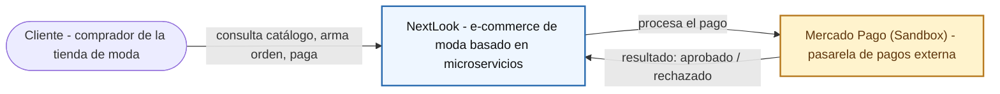

# NextLook — Arquitectura de Microservicios para E-Commerce de Moda

Un e-commerce de moda necesita consultar catálogo y variantes, gestionar órdenes, controlar inventario en tiempo real y procesar pagos de forma segura, sin que un componente sobrecargado bloquee a los demás.

**Equipo:** Anghelo, Yeins, Daniel, Johan.
**Docente:** Abel Angel Sullon Macalupu.

Flujo de dominio: **Catálogo → Selección → Orden → Reserva de stock → Pago → Confirmación**.

## Arquitectura NextLook

### Nivel 1: Contexto del sistema (System Context — C4 nivel 1)

NextLook se ve como una sola caja negra: sin microservicios, sin eventos, sin Keycloak por dentro. Solo importa quién lo usa (el cliente) y con qué sistema externo conversa (la pasarela de pagos, Mercado Pago en modo Sandbox). El detalle interno aparece recién en el nivel 2.

### Nivel 2: Contenedores (Container diagram — C4 nivel 2)

```mermaid
%%{init: {"flowchart": {"nodeSpacing": 20, "rankSpacing": 34, "curve": "basis"}} }%%
flowchart TB
    Cliente(["Cliente"])

    subgraph IdentidadCliente["Identidad y Cliente"]
        Keycloak["Keycloak - Identity Provider (emite JWT)"]
        ClienteMS["cliente-ms (no transaccional)"]
        ClienteDB[("cliente_db")]
        ClienteMS --> ClienteDB
    end

    subgraph CatalogoInventario["Catálogo e Inventario"]
        CatalogoMS["catalogo-ms (no transaccional)"]
        CatalogoDB[("catalogo_db")]
        InventarioMS["inventario-ms (transaccional)"]
        InventarioDB[("inventario_db")]
        ResenasMS["resenas-ms (no transaccional)"]
        ResenasDB[("resenas_db")]
        CatalogoMS --> CatalogoDB
        InventarioMS --> InventarioDB
        ResenasMS --> ResenasDB
    end

    subgraph OrdenPago["Órdenes y Pago"]
        OrdenMS["orden-ms (transaccional)"]
        OrdenDB[("orden_db")]
        PagoMS["pago-ms (transaccional)"]
        PagoDB[("pago_db")]
        OrdenMS --> OrdenDB
        PagoMS --> PagoDB
    end

    subgraph EnvioNotif["Envío y Notificaciones"]
        EnvioMS["envio-ms (transaccional)"]
        EnvioDB[("envio_db")]
        NotifMS["notificaciones-ms (no transaccional)"]
        NotifDB[("notificaciones_db")]
        EnvioMS --> EnvioDB
        NotifMS --> NotifDB
    end

    MercadoPago["Mercado Pago (Sandbox) - sistema externo"]

    %% Punto de entrada del cliente (Gateway u otro componente de acceso: PENDIENTE de confirmar, ver nota debajo)
    Cliente -->|"consulta catálogo"| CatalogoMS
    Cliente -->|"gestiona perfil / direcciones"| ClienteMS
    Cliente -->|"crea orden"| OrdenMS
    Cliente -->|"escribe reseña"| ResenasMS

    %% Comunicación síncrona (REST/Feign)
    OrdenMS -->|"REST: valida cliente"| ClienteMS
    EnvioMS -->|"REST: obtiene dirección"| ClienteMS
    ResenasMS -->|"REST: valida producto"| CatalogoMS
    ResenasMS -->|"REST: valida compra"| ClienteMS
    PagoMS -->|"REST: procesa pago"| MercadoPago

    %% Comunicación asíncrona (eventos)
    OrdenMS -.->|"evento: Orden Creada"| InventarioMS
    PagoMS -.->|"evento: resultado del pago"| OrdenMS
    PagoMS -.->|"evento: resultado del pago"| InventarioMS
    OrdenMS -.->|"evento: Pago Aprobado"| EnvioMS
    OrdenMS -.->|"evento"| NotifMS
    PagoMS -.->|"evento"| NotifMS
    InventarioMS -.->|"evento"| NotifMS
    EnvioMS -.->|"evento"| NotifMS

    %% Seguridad: cada microservicio valida el JWT emitido por Keycloak de forma independiente
    Keycloak -.->|"valida JWT"| ClienteMS
    Keycloak -.->|"valida JWT"| CatalogoMS
    Keycloak -.->|"valida JWT"| InventarioMS
    Keycloak -.->|"valida JWT"| ResenasMS
    Keycloak -.->|"valida JWT"| OrdenMS
    Keycloak -.->|"valida JWT"| PagoMS
    Keycloak -.->|"valida JWT"| EnvioMS
    Keycloak -.->|"valida JWT"| NotifMS

    classDef external fill:#fff3cd,stroke:#b7791f,stroke-width:2px,color:#5f370e;
    class MercadoPago external;
```

Convención del diagrama: las flechas continuas representan comunicación síncrona (REST/Feign) o el acceso directo del cliente; las flechas punteadas representan comunicación asíncrona por eventos y la dependencia de seguridad de cada microservicio hacia Keycloak (validación de JWT).

!!! warning "Datos pendientes de confirmar"
    Este diagrama solo incluye lo que el brief técnico confirma. **No** se dibujan puertos, Config Server, Eureka/discovery, API Gateway, ni tecnología de mensajería (Kafka/RabbitMQ/otro), porque el brief aprobado no los especifica todavía. Cuando el equipo defina esos componentes, hay que actualizar este diagrama con:

    - Puertos de cada microservicio (DEV/PROD) y de sus bases de datos.
    - Si existe un API Gateway como punto único de entrada (hoy el diagrama conecta al cliente directo con cada microservicio).
    - Nombre y tecnología del Config Server / Service Registry, si el proyecto los usa.
    - Tecnología del broker de eventos (Kafka, RabbitMQ, u otro) para la comunicación asíncrona.
    - Motor de persistencia de cada base de datos (hoy son cilindros genéricos, sin motor asignado).

## Flujo de trabajo

1. El cliente consulta el catálogo (`catalogo-ms`) y arma su selección de prendas y variantes.
2. Registra una orden (`orden-ms`), que valida al cliente contra `cliente-ms` antes de confirmarla.
3. `orden-ms` solicita la reserva de stock a `inventario-ms` mediante un evento asíncrono.
4. El cliente paga mediante `pago-ms`, que llama directamente a la API real de Mercado Pago (Sandbox).
5. `pago-ms` emite un evento con el resultado del pago (aprobado/rechazado); `orden-ms` e `inventario-ms` lo consumen para actualizar el estado de la orden y confirmar o liberar la reserva de stock.
6. Si el pago es aprobado, `orden-ms` notifica a `envio-ms` para iniciar el envío.
7. `notificaciones-ms` escucha los eventos de `orden-ms`, `pago-ms`, `inventario-ms` y `envio-ms` para avisar al cliente en cada paso.

## Contenido de esta documentación

- [Estado de avance](avance.md): qué está implementado y corriendo hoy, y el roadmap de fases pendientes.
- [Brief técnico](brief.md): ficha completa del proyecto, equipo y microservicios, aprobada por el docente.
- [Arquitectura](arquitectura.md): los diagramas C4 con su explicación detallada.
- [Microservicios](microservicios/orden-ms.md): ficha por servicio (responsable, tipo, endpoints, entidades).
- [Seguridad](seguridad.md): Keycloak, JWT y roles.
- [Comunicación entre servicios](comunicacion.md): interacciones síncronas y asíncronas.
- [Integración de pago](integracion-pago.md): flujo con Mercado Pago.
- [Flujo end-to-end](flujo-end-to-end.md): el recorrido completo de una compra.
- [Consistencia de datos](consistencia.md): estados de la reserva de stock.
- [Notificaciones](notificaciones.md): cómo `notificaciones-ms` procesa los eventos del sistema.
- [Alcance](alcance.md): qué cubre y qué no cubre el proyecto.
