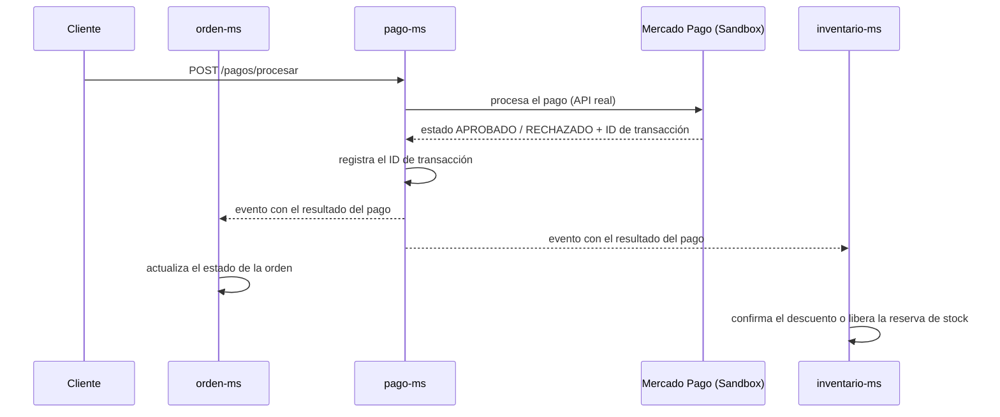

# Integración de pago

`pago-ms` integra la API real de Mercado Pago (Sandbox). No simula el pago: llama directamente a la pasarela y registra lo que esta devuelve.

La llamada `pago-ms → Mercado Pago` es síncrona (petición directa a la API externa). Los avisos de `pago-ms` hacia `orden-ms` e `inventario-ms` son asíncronos (eventos).

## Requisitos clave de `pago-ms`

- `POST /pagos/procesar` llama a la API real de Mercado Pago (Sandbox); el resultado es `APROBADO` o `RECHAZADO`.
- Registra el ID de transacción que devuelve la pasarela.
- Emite un evento con el resultado del pago.
- `orden-ms` actualiza el estado de la orden a partir de ese evento.
- `inventario-ms` confirma el descuento definitivo de stock (pago aprobado) o libera la reserva (pago rechazado u orden cancelada) a partir de ese mismo evento.

!!! warning "Datos pendientes de confirmar"
    El brief no detalla el contrato exacto de `POST /pagos/procesar` (request/response), ni las credenciales/configuración de Sandbox, ni la tecnología de mensajería usada para emitir el evento de resultado. Completar cuando el servicio esté implementado.
