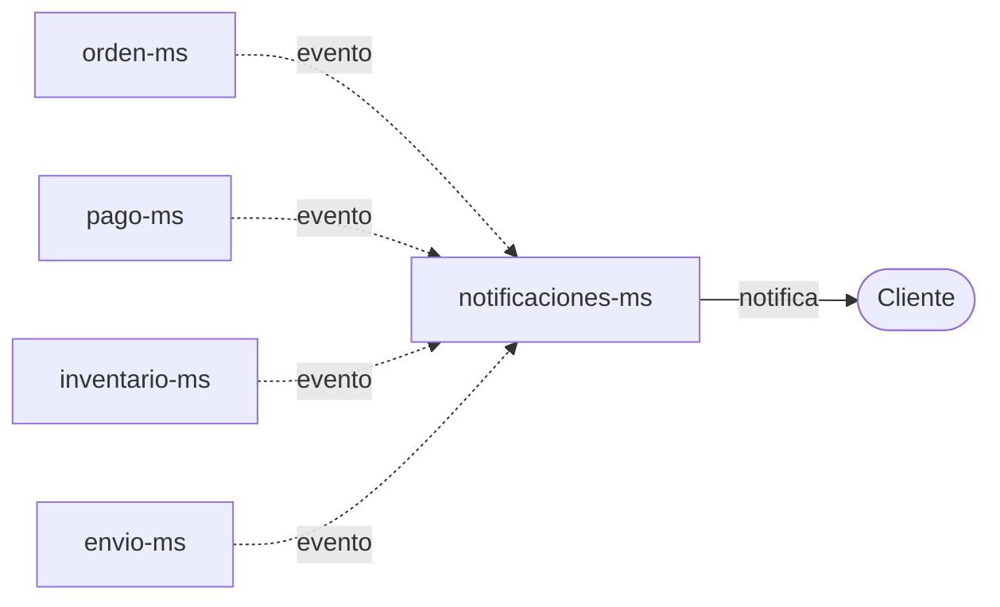

# Notificaciones

`notificaciones-ms` no expone un flujo de negocio propio — escucha eventos de otros microservicios y avisa al cliente.

## Eventos que escucha

| Origen | Tipo de evento |
|---|---|
| `orden-ms` | Ciclo de vida de la orden. |
| `pago-ms` | Resultado del pago. |
| `inventario-ms` | Movimientos/estado de la reserva de stock. |
| `envio-ms` | Envío y seguimiento de la entrega. |

## Capacidades

- **Registro de estado:** cada notificación se registra con su propio estado de envío.
- **Plantillas:** configurables por tipo de evento y por canal.
- **Reintentos:** los envíos fallidos se reintentan, con un límite configurable.
- **Trazabilidad:** cada notificación conserva la referencia al evento de negocio que la originó.

!!! warning "Datos pendientes de confirmar"
    El brief no especifica los canales concretos (email, SMS, push, etc.) ni el número exacto del límite de reintentos. Completar en la ficha de [notificaciones-ms](microservicios/notificaciones-ms.md) cuando el equipo lo defina.
