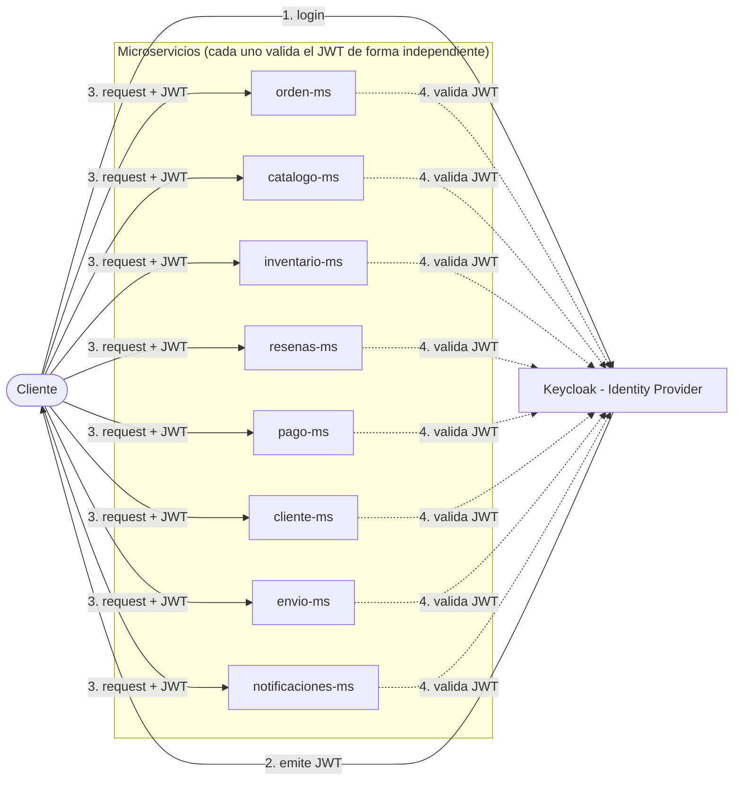

# Seguridad

Keycloak actúa como Identity Provider centralizado y emite JWT. Cada uno de los 8 microservicios valida el token de forma independiente — no hay un componente central (Gateway u otro) confirmado en el brief que intercepte y valide por todos.

## Roles

| Rol | Puede |
|---|---|
| `CLIENTE` | Crear órdenes, gestionar su propio perfil, sus direcciones de envío y sus reseñas. |
| `ADMIN` | Gestión global de catálogo, inventario, clientes y notificaciones. |

## Protección por microservicio

| Microservicio | Rol que lo protege principalmente |
|---|---|
| `orden-ms` | `CLIENTE` — crea y consulta sus propias órdenes. |
| `catalogo-ms` | `ADMIN` — gestión global del catálogo. |
| `inventario-ms` | `ADMIN` — gestión global de inventario. |
| `resenas-ms` | `CLIENTE` — gestiona sus propias reseñas. |
| `pago-ms` | `CLIENTE` — paga sus propias órdenes. |
| `cliente-ms` | `CLIENTE` — gestiona su propio perfil y direcciones. |
| `envio-ms` | `CLIENTE` (seguimiento de su envío) / `ADMIN` (gestión global). |
| `notificaciones-ms` | `ADMIN` — gestión global de notificaciones. |

!!! warning "Datos pendientes de confirmar"
    El brief no especifica el detalle de los endpoints protegidos por cada rol, ni si existe un componente de Gateway que centralice la validación. Cuando el equipo lo defina, completar la sección "Endpoints" de cada microservicio con la protección exacta por ruta.
